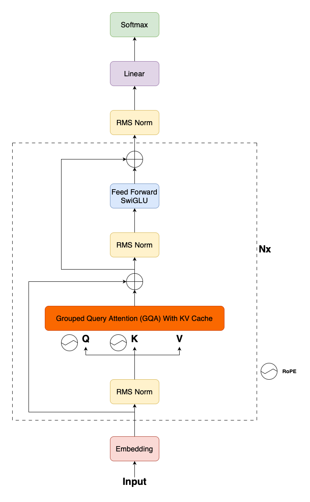
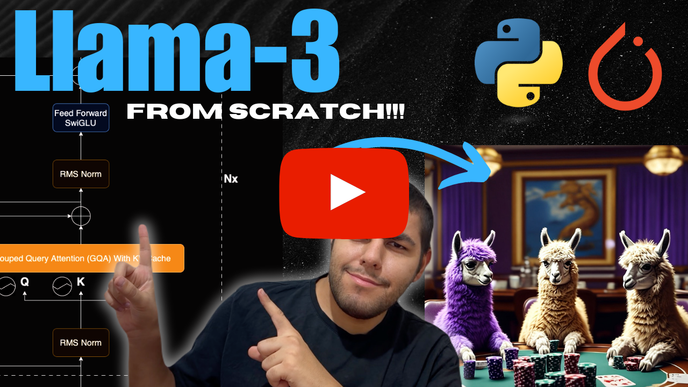

## Llama 3 Implementation With PyTorch

<div align="center">
    <a href="">
        
    </a>
    <a href="https://www.youtube.com/watch?v=lrWY4O5kUTY">
        
    </a>
</div>
<br/>
<div align="center">
    <p>Liked our work? give us a ⭐!</p>
</div>

<p align="center">
  
</p>

This repository contains implementation of Llama 3 that is introduced in the paper [The Llama 3 Herd of Models](https://arxiv.org/abs/2407.21783) using PyTorch. You can [access the weights from Meta website here](https://www.llama.com/llama-downloads/). I took [Meta's official implementation](https://github.com/meta-llama/llama3) as the base of this project. Since all Llama models are built on top of each other, you can use this repository for other Llama implementations as well.

## YouTube Tutorial
<div align="center">
    <a href="https://www.youtube.com/watch?v=lrWY4O5kUTY">Implement Llama From Scratch - PyTorch</a>
    <br>
    <br>
    <a href="https://www.youtube.com/watch?v=lrWY4O5kUTY">
        
    </a>
</div>

## Table of Contents
* [Llama 3 Implementation](#llama3)
    * [Hyperparameters](#hyper)
    * [RMSNorm](#rms)
    * [Rotrary Embedding](#rope)
    * [Feed Forward SwiGLU](#ffn)
    * [Attention](#attn)
    * [Transformer Block](#block)
    * [Transformer](#transformer)

## Llama 3 Implementation <a class="anchor" id="llama3"></a>
We need several classes to implement Llama 3. The main ones are `Attention`, `Transformer Block` and `Transformer`.

### Hyperparameters <a class="anchor" id="hyper"></a>

```
DIM = 4096 # Llama3 Table 3.
FFN_DIM = 14336 # For POSITION-WISE FEED-FORWARD NETWORK (FFN) Llama Table 3
N_LAYERS = 32 # Llama3 Table 3.
N_HEADS = 32 # Llama3 Table 3.
N_KV_HEADS = 8 # With 8 key-value heads to improve inference speed and to reduce the size (llama3)
VOCAB_SIZE = 128256 # Llama3 vocab size. Llama3 paper says 128K. This is the exact number taken from tokenizer.
NORM_EPS = 1e-5 # Took from Llama3 code ModelArgs.
ROPE_THETA = 500000 # We increase the RoPE base frequency hyperparameter to 500,000 (llama3)
MAX_BATCH_SIZE = 4 # Just optional depending on your specs. If number of examples you provide is smaller, it takes it as batch size.
MAX_SEQ_LEN = 128 # Just optional depending on your specs.
N_KV_HEAD_REP = N_HEADS // N_KV_HEADS # How many times you repeat KV to match your queries(N_HEADS).
HEAD_DIM = DIM // N_HEADS # Divide dimension by number of heads to get dimension per head.
```

### RMSNorm <a class="anchor" id="rms"></a>

```
class RMSNorm(torch.nn.Module):
    def __init__(self, dim, norm_eps):
        super().__init__()
        self.norm_eps = norm_eps
        self.weight = nn.Parameter(torch.ones(dim))

    def _norm(self, x):
        return x * torch.rsqrt(x.pow(2).mean(-1, keepdim=True) + self.norm_eps)
    
    def forward(self, x):
        out = self._norm(x.float()).type_as(x)
        return out * self.weight # (2, 8, DIM) Values stays the same. We make the tensor grad_fn.
```

### RoPE (Rotrary Positional Embeddings) <a class="anchor" id="rope"></a>

```
def precompute_freqs_cis(dim, end, theta = 10000.0):
    freqs = 1.0 / (theta ** (torch.arange(0, dim, 2)[: (dim // 2)].float() / dim))
    t = torch.arange(end, device=freqs.device, dtype=torch.float32)
    freqs = torch.outer(t, freqs)
    freqs_cis = torch.polar(torch.ones_like(freqs), freqs)  # complex64
    return freqs_cis


def reshape_for_broadcast(freqs_cis, x):
    ndim = x.ndim
    assert 0 <= 1 < ndim
    assert freqs_cis.shape == (x.shape[1], x.shape[-1])
    shape = [d if i == 1 or i == ndim - 1 else 1 for i, d in enumerate(x.shape)]
    return freqs_cis.view(*shape)


def apply_rotary_emb(xq, xk, freqs_cis):
    xq_ = torch.view_as_complex(xq.float().reshape(*xq.shape[:-1], -1, 2))
    xk_ = torch.view_as_complex(xk.float().reshape(*xk.shape[:-1], -1, 2))
    freqs_cis = reshape_for_broadcast(freqs_cis, xq_)
    xq_out = torch.view_as_real(xq_ * freqs_cis).flatten(3)
    xk_out = torch.view_as_real(xk_ * freqs_cis).flatten(3)
    return xq_out.type_as(xq), xk_out.type_as(xk)
```

### Feed Forward SwiGLU <a class="anchor" id="ffn"></a>
```
class FeedForward(nn.Module):
    def __init__(self):
        super().__init__()

        # Bias is false. It usually adds overhead to the transformer models.
        self.w1 = nn.Linear(DIM, FFN_DIM, bias=False)
        self.w3 = nn.Linear(DIM, FFN_DIM, bias=False)
        self.w2 = nn.Linear(FFN_DIM, DIM, bias=False)

    def forward(self, x):
        return self.w2(F.silu(self.w1(x)) * self.w3(x)) # (2, 8, DIM) = (bsz, seqlen, DIM) - use the SwiGLU activation function (llama3) Table 3.
```

### Grouped Query Attention (GQA) With KV Cache <a class="anchor" id="attn"></a>
```
# GQA With Cache
class Attention(nn.Module):
    def __init__(self):
        super().__init__()
        self.wq = nn.Linear(DIM, N_HEADS * HEAD_DIM, bias=False)
        self.wk = nn.Linear(DIM, N_KV_HEADS * HEAD_DIM, bias=False)
        self.wv = nn.Linear(DIM, N_KV_HEADS * HEAD_DIM, bias=False)
        self.wo = nn.Linear(N_HEADS * HEAD_DIM, DIM, bias=False) # Weight matrix defined in the MultiheadAttention formula.

        # Create empty caches for keys and values.
        self.cache_k = torch.zeros(
            (
                MAX_BATCH_SIZE,
                MAX_SEQ_LEN,
                N_KV_HEADS,
                HEAD_DIM,
            )
        )
        self.cache_v = torch.zeros(
            (
                MAX_BATCH_SIZE,
                MAX_SEQ_LEN,
                N_KV_HEADS,
                HEAD_DIM,
            )
        )

    def forward(self, x, start_pos, freqs_cis, mask):
        bsz, seqlen, _ = x.shape # Get batch size and sequence length. (bsz, seqlen, DIM)
        queries, keys, values = self.wq(x), self.wk(x), self.wv(x) # q -> (bsz, seqlen, N_HEADS*HEAD_DIM) | k,v -> (bsz, seqlen, N_KV_HEADS*HEAD_DIM)

        queries = queries.view(bsz, seqlen, N_HEADS, HEAD_DIM)
        keys = keys.view(bsz, seqlen, N_KV_HEADS, HEAD_DIM)
        values = values.view(bsz, seqlen, N_KV_HEADS, HEAD_DIM)

        queries, keys = apply_rotary_emb(queries, keys, freqs_cis=freqs_cis)

        self.cache_k = self.cache_k.to(queries.device)
        self.cache_v = self.cache_v.to(queries.device)

        self.cache_k[:bsz, start_pos : start_pos + seqlen] = keys
        self.cache_v[:bsz, start_pos : start_pos + seqlen] = values

        keys = self.cache_k[:bsz, : start_pos + seqlen]
        values = self.cache_v[:bsz, : start_pos + seqlen]

        # In these runs we simply duplicated the KV heads for MQA in all GPUs. (llama2)
        keys = torch.repeat_interleave(
            keys, dim=2, repeats=N_KV_HEAD_REP
        ) # (bsz, seqlen, N_KV_HEADS, HEAD_DIM) -> (bsz, seqlen, N_HEADS, HEAD_DIM)
        values = torch.repeat_interleave(
            values, dim=2, repeats=N_KV_HEAD_REP
        )  # (bsz, seqlen, N_KV_HEADS, HEAD_DIM) -> (bsz, seqlen, N_HEADS, HEAD_DIM)

        # Reshaping for scaled_dot_product_attention. (bsz, ..., seqlen, HEAD_DIM) expected.
        queries = queries.transpose(1, 2) # (bsz, seqlen, N_HEADS, HEAD_DIM) -> (bsz, N_HEADS, seqlen, HEAD_DIM)
        keys = keys.transpose(1, 2) # (bsz, seqlen, N_HEADS, HEAD_DIM) -> (bsz, N_HEADS, seqlen, HEAD_DIM)
        values = values.transpose(1, 2) # (bsz, seqlen, N_HEADS, HEAD_DIM) -> (bsz, N_HEADS, seqlen, HEAD_DIM)

        out = F.scaled_dot_product_attention(
            queries,
            keys,
            values,
            attn_mask=mask,
        ) # (bsz, N_HEADS, seqlen, HEAD_DIM)
        
        
        # If we don't use `contiguous` torch may complain.
        out = out.transpose(1, 2).contiguous().view(bsz, seqlen, -1) # transpose, (bsz, seqlen, N_HEADS, HEAD_DIM) - (bsz, seqlen, DIM) - -1 does N_HEAD * HEAD_DIM = DIM
        return self.wo(out) # (bsz, seqlen, DIM)
```

### Transformer Block <a class="anchor" id="block"></a>
```
class TransformerBlock(nn.Module):
    def __init__(self):
        super().__init__()
        self.attention = Attention()
        self.feed_forward = FeedForward()
        self.attention_norm = RMSNorm(DIM, NORM_EPS)
        self.ffn_norm = RMSNorm(DIM, NORM_EPS)

    def forward(self, x, start_pos, freqs_cis, mask):
        h = x + self.attention(self.attention_norm(x), start_pos, freqs_cis, mask) # (2, 8, 4096) = (bsz, seqlen, DIM)
        out = h + self.feed_forward(self.ffn_norm(h)) # (2, 8, DIM) = (bsz, seqlen, DIM)
        return out # (2, 8, DIM) = (bsz, seqlen, DIM)
```

### Transformer (Llama Model)<a class="anchor" id="transformer"></a>
```
class Transformer(nn.Module):
    def __init__(self):
        super().__init__()
        self.tok_embeddings = nn.Embedding(
            VOCAB_SIZE, DIM
        )
        
        self.layers = torch.nn.ModuleList()
        for _ in range(N_LAYERS):
            self.layers.append(TransformerBlock())

        self.norm = RMSNorm(DIM, NORM_EPS)
        self.output = nn.Linear(DIM, VOCAB_SIZE, bias=False,)

        self.freqs_cis = precompute_freqs_cis(
            HEAD_DIM,
            MAX_SEQ_LEN * 2,
            ROPE_THETA,
        )

    @torch.inference_mode()
    def forward(self, tokens, start_pos):       
        _bsz, seqlen = tokens.shape
        h = self.tok_embeddings(tokens) # (bsz, seqlen, DIM)
        self.freqs_cis = self.freqs_cis.to(tokens.device)
        freqs_cis = self.freqs_cis[start_pos : start_pos + seqlen]

        mask = None # When we take the tokens from the cached values (seqlen=1) we don't need any aditional mask.
        if seqlen > 1: # Because of KV Cache, we process only 1 token. However, the first run doesn't have any cache. So it has a seqlen > 1.
            mask = torch.full((seqlen, seqlen), float("-inf"), device=tokens.device) # Since this is the first pass, we don't have any KV Cache. So we need a mask. Create (seqlen, seqlen) matrix with float("-inf") values.

            mask = torch.triu(mask, diagonal=1).to(tokens.device) # Take the upper triangle excluding diagonal since it's casual LM.

        for layer in self.layers:
            h = layer(h, start_pos, freqs_cis, mask) # (2, 8, 4096) = (bsz, seqlen, DIM)
        h = self.norm(h) # (2, 8, 4096) = (bsz, seqlen, DIM)
        out = self.output(h).float() # (2, 8, 128256) = (bsz, seqlen, VOCAB_SIZE)
        return out # (2, 8, 128256) = (bsz, seqlen, VOCAB_SIZE)
```
